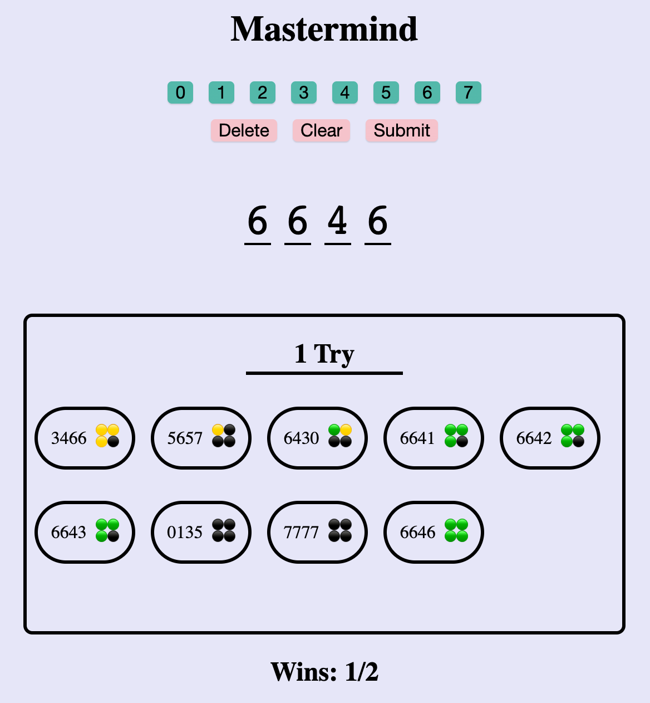
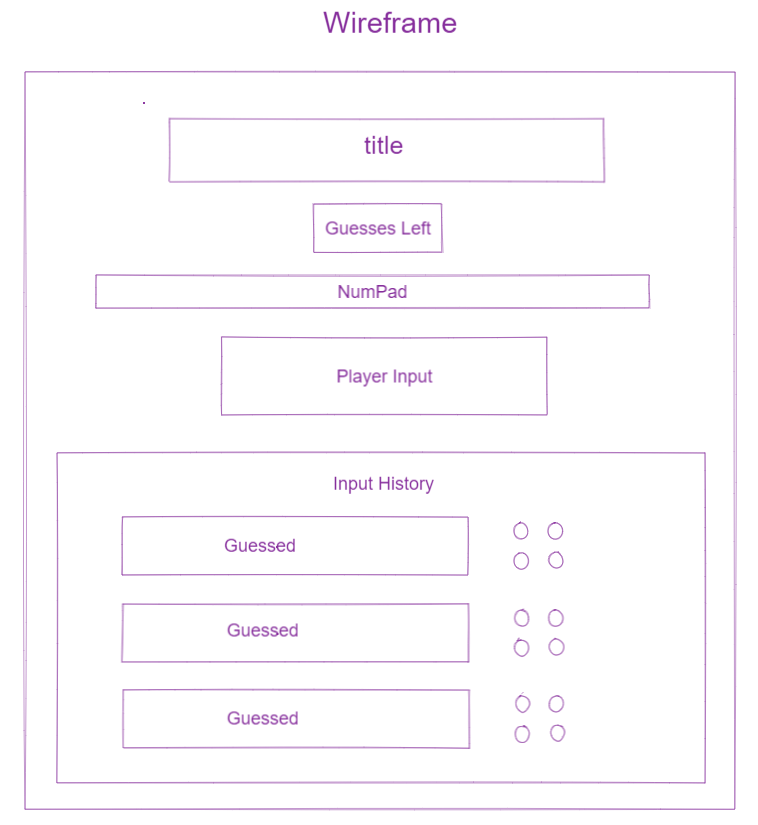
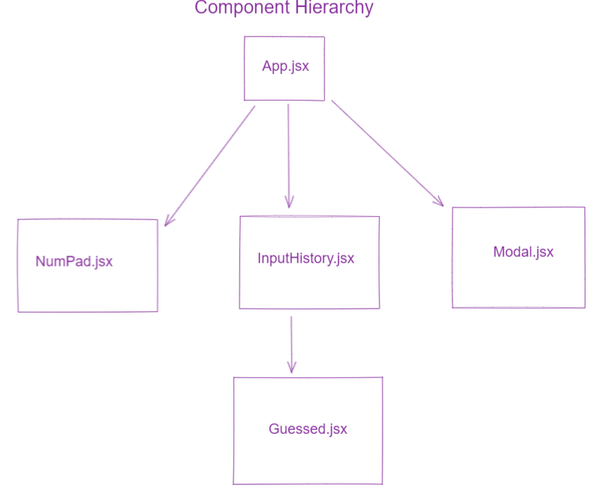

## Description

This is the Mastermind game, originally designed by Mordecai Meirowitz in 1970. The player will be playing against the mastermind who has chosen a 4 number sequence. To defeat the mastermind, you will have to guess this code to save yourself.

## How do I use this?

1. Install dependencies: `npm install`
2. Start the node server: `npm run server`
3. Run webpack: `npm run build`
4. Open the app at http://localhost:3000.

## Rules

- The player will have 10 tries to guess the correct 4 digit code.
- Each number in the code ranges from 0 - 7 and ***CAN*** contain duplicates.
- After each guess, one of the 3 response below can happen for each number:  1. A green dot (🟢) indicates a correct number is in the right location. 2. A yellow dot (🟡) indicates a correct number but not in the right location.  3. A black dot (⚫) indicates that a number is incorrect.
- Keep in mind that the position of the dots do not align with the positions of the numbers in the guess.

## Thought Process
1. My first step was to design a wireframe for my app and think of all the pieces I would need to make this game functional.

2. I chose React.js for this project because I like the speed, efficiency, and modularity it provides. I then designed the component hierarchy, this helped me visualize how components will be mounted and how the data will flow.

3. I started by creating the server and this is where I made requests to the random number API and then transform the response into the right data structure for the client. I had the server reshape the data because I wanted to modularize my process and didn't want my front end to handle all the load.

4. After creating my 2 diagrams, I wanted to create a basic UI first so I could start implementing the game logic. I started with the top level component, App.jsx.

5. **App.jsx** is the component where I made a request to the server to hit the random number API to get the code. After the code is retrieved, I pass the number sequence down to other components as props.

6. **Numpad.jsx** handles all of the button functionalities as well as the input field. The number buttons show the user that the inputs can only range from 0 - 7. Users can use buttons to play the game as well as directly type the sequence into the input field.

7. **Modal.jsx** is a simple pop up modal that appears when the player reaches either the winning or losing condition. The winning and losing condition is housed inside the guess submission function; the moment when a user submits an answer, whether or not a game ends is checked.

8. The **InputHistory.jsx** component contains the history of all the guesses the player has attempted. The Guessed component is mounted on this one. In addition, the number of tries remaining is displayed in this component.

9. The **Guessed.jsx** component contains player's guess and the from the answer checking algorithm. The number and feedbacks are set as state, and each time a guess is entered, a re-render happens to update the page.

## Extensions
- **Score Keeper**: for this extension, I decided to implement a score keeper that would allow numbers of wins and games played to persist. I used window's localStorage property to store data across browser sessions. Everytime a game ends, the information is saved. If the browser was closed, the score will persist. I thought about using an external database like Firebase but due to time constraints, localStorage does the job and was quicker for implementation.

- **Tests**: I wrote a few simple unit tests using the Jest framework and the Supertest library for my Express server. The tests primarily test the response recevied from my initialize route, ensure that the data from the random numbers API is being fetched as intended. First test checks if the response is a parseable array. Second test checks if the length of the array is 4. Third test checks if the elements are numbers. If I had more time, I would also look into React Testing Library and write a few tests for the front end.

- **Hard Mode**: Implement a hard mode that takes in a larger range of numbers. Instead of 0 - 7, when clicked on the Hard button, 0 - 9 inputs will be used instead. For this feature, I used state to control whether or not hard mode is initialized, then used conditional rendering to show updated components. 

## Tech Stack

- React.js
- Node.js
- Express.js
